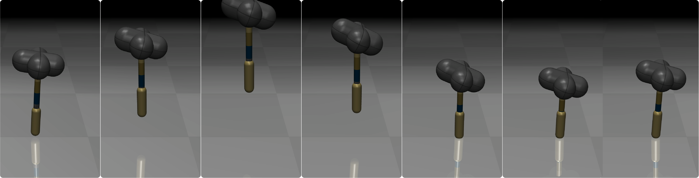

<p align="center">
  <p align="center"> 

  
  <h1 align="center">Materials Matter: Investigating Functional Advantages of Bio-Inspired Materials via Simulated Robotic Hopping
  </h1>
  <p align="center">
    <a href="https://is.mpg.de/person/rokhmanova"><strong>Andrew K. Schulz*</strong></a>
    ·
    <a href="https://ayah-ahmad.github.io/"><strong>Ayah G. Ahmad*</strong></a>
    ·
	<a href="https://maegantucker.com/"><strong>Maegan Tucker*</strong></a>
    ·
</p>
<p>

  </p>
  <strong>*</strong> designates equivalent contributions to this GitHub repository. 
</p>
<p align="center" style="margin: 2em auto;">
    <a href='https://arxiv.org/'></a>
  </p>

</div>
Table of contents
-----
  * [Installation](#Installation)
  * [Data](#Data)
  * [Method](#Method)
    * [Ground-truth MRI Bones](#MRI-Bones)
    * [Learning Regressors](#Learning-regressors)
    * [SKEL-J](#SKEL-J)
  * [Evaluation](#Evaluation)
    * [Baselines](#Run-Baselines)
    * [Compute Metrics](#Compute-Metrics)
    * [Visualize](#Visualize)
  * [Acknowledgements](#Acknowledgements)
  * [Citation](#Citation)
  * [License](#License)
------

## Installation
This code was tested with:
- Ubuntu 22.4
- CUDA 11.8
- python 3.9 


# mat-hopper
This repository provides a simulation environment for one-legged hopping that models physical material designs. This repository is intended to accompany our ICRA 2025 submission titled ''Materials Matter: Investigating Functional Advantages of Bio-Inspired Materials via Simulated Robotic Hopping''.


## Simulation Setup
Our framework utilizes the python bindings of MuJoCo (documentation: https://mujoco.readthedocs.io/en/stable/python.html)
To install this on your computer, you should only have to run the following
``` 
pip install mujoco
```
Note: DO NOT try and install `mujoco_py`, this is an outdated and no-longer-maintained version of mujoco python.

After installing `mujoco`, you can test your installation by opening the standalone app:
```
python -m mujoco.viewer
```

## Run Simulations of Mono-Materials
To run the first set of experiments, run the python script `run_experiment_one.py`:
```
python run_experiment_one.py
```

## Run Simulation Sweeps (across material density and material stiffness separately)
To run the second set of experiments, run the python script `run_experiment_two.py`:
```
python run_experiment_two.py
```

## Run Simulations of Functional Gradients
To run the third set of experiments, run the python script `run_experiment_three.py`:
```
python run_experiment_three.py
```

## Run Simulation Speed Experiments
To obtain the heatmap depicted in Figure 4, run the python script `run_experiment_simtimes.py`:
```
python run_experiment_simtimes.py
```

## Simulate Hopping
Lastly, to simulate a single instance of one-legged hopping, run the python script `test_hopping.py`
```
python test_hopping
```
Within this script, you can select which behavior you would like to run, and which xml you would like to utilize. 

## Citation

```bibtex
@misc{schulz_materials_2024,
	title = {Materials Matter: Investigating Functional Advantages of Bio-Inspired Materials via Simulated Robotic Hopping},
	author = {Schulz, Andrew K. and Ahmad, Ayah G. and Tucker, Maegan},
	year = {2024},
}

```


